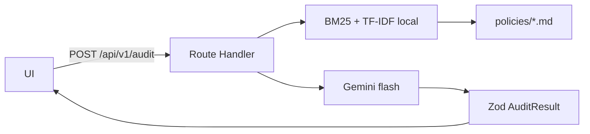

# CloudSec & FinOps Compliance Auditor

Console interno de auditoria. Você descreve um cenário de arquitetura;
o serviço compara com políticas CIS / SOC 2 / FinOps em Markdown e
devolve um parecer JSON: status, risco, citações, remediação e impacto
de custo.

UI e API no mesmo Next.js — um deploy na Vercel. Sem FastAPI ao lado
e sem Streamlit no caminho principal. O browser só chama
`POST /api/v1/audit`. Quem fala com o Gemini é o route handler.

EN: CloudSec/FinOps auditor — Next.js App Router, hybrid RAG over
versioned markdown, Gemini structured JSON, Zod envelope
`{ latency_ms, audit }`. Same repo.

## Por que assim



Route handler no App Router, não um serviço Python: o alvo é um
projeto só na Vercel. RAG in-process (BM25 + vetor TF-IDF hasheado +
RRF) porque Qdrant na nuvem é custo e ops à toa para um corpus deste
tamanho. O denso troca em `src/lib/rag/embeddings.ts`: no dia em que
o corpus crescer, vira `qdrant.search`; o léxico fica.

`responseSchema` + Zod porque modelo solto devolve prosa. Envelope
`{ latency_ms, audit }` — sem isso a UI inventa métrica. Uso
`gemini-2.5-flash` com fallback `gemini-2.0-flash`; Pro não agrega
neste fluxo.

Faithfulness ≥ 0.85 existe porque citação inventada queima o parecer.
O job de eval no Actions não quebra se o secret `GEMINI_API_KEY`
faltar: sem chave não tem o que julgar, e score inventado não entra
no repo.

## Local

```bash
npm install
cp .env.example .env.local
npm run dev
```

http://localhost:3000 — `GEMINI_API_KEY` só é obrigatória na auditoria,
não no `npm run build`.

```bash
npm run build
npm run typecheck
npm run lint
npm test             # retrieval + schema; não chama o modelo
npm run eval         # caminho real; no-op sem chave
```

| Variável | Uso | Default |
| --- | --- | --- |
| `GEMINI_API_KEY` | `POST /api/v1/audit` | — |
| `GEMINI_MODEL` | opcional | `gemini-2.5-flash` |
| `GEMINI_FALLBACK_MODEL` | opcional | `gemini-2.0-flash` |
| `AUDIT_ACCESS_TOKEN` | opcional; se setado, exige Bearer/`x-audit-token` | — |

## Vercel

Projeto Next.js. Em **Settings → Environment Variables**, gravar
`GEMINI_API_KEY` em Production e Preview. Sem essa variável o
`GET /api/health` responde `gemini_configured: false` e
`POST /api/v1/audit` devolve `503 MISSING_API_KEY`.

Opcionais: `GEMINI_MODEL`, `GEMINI_FALLBACK_MODEL`, `AUDIT_ACCESS_TOKEN`.
`POST /api/v1/audit` limita o cenário a 8000 caracteres, recusa corpos grandes
e aplica rate limit por IP (best-effort por instância). Sem token o console
interno continua público; com token só callers autenticados gastam a chave.
Build: `npm run build`. Output padrão.

## CI

[`.github/workflows/ci.yml`](.github/workflows/ci.yml)

- **unit** — lint, `tsc`, Vitest (corpus + ranking do S3 público).
- **eval** — com secret `GEMINI_API_KEY`, roda `npm run eval` e o
  DeepEval no mesmo artefato. Sem secret, o job só registra o skip.

Secret: Settings → Secrets and variables → Actions → `GEMINI_API_KEY`.

## Políticas

Uma cláusula por arquivo em [`policies/`](policies/). Não vai um blob
no prompt. Núcleo: `POL-S3-001`, `POL-S3-002`, `POL-IAM-005`. O resto
(KMS, CloudTrail, MFA Delete, NAT, tags) existe para o retriever ter
o que errar — com três textos o BM25 acerta no chute.

| ID | Cláusula | Severidade |
| --- | --- | --- |
| POL-S3-001 | Block Public Access em bucket de dado de cliente | CRITICAL · SOC 2 |
| POL-S3-002 | Versionamento + lifecycle para Glacier em 90 dias | FinOps 4.2 |
| POL-IAM-005 | Sem `AdministratorAccess` direto no IAM user | Least privilege |
| POL-S3-003 / 004 | SSE-KMS, access logging | HIGH / MEDIUM |
| POL-IAM-001 / 003 | MFA, rotação de key em 90 dias | HIGH / MEDIUM |
| POL-FIN-001 / 002 | Idle spend, tags de alocação | FinOps |
| POL-NET-001 | Sem `0.0.0.0/0` em porta admin | HIGH |

Para Qdrant depois: embeddar os chunks, upsert com `policyId` /
`heading` / `text`, trocar `scoreDense()`. Envelope da API não muda.
