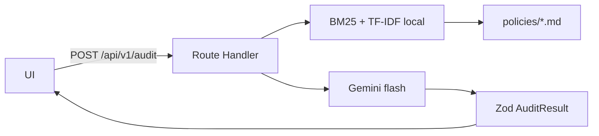

# CloudSec & FinOps Compliance Auditor

Auditor interno (demo pública) de cenário de arquitetura contra
políticas CIS / SOC 2 / FinOps em Markdown. O parecer é JSON tipado:
status, risco, citações, remediação e impacto de custo.

API e UI no mesmo Next.js — um deploy na Vercel. Sem FastAPI ao lado,
sem Streamlit no caminho principal. O browser só chama
`POST /api/v1/audit`. Quem fala com o Gemini é o route handler.

## Por que assim



Route Handler no App Router, não um serviço Python, porque o alvo é um
projeto só na Vercel. RAG in-process (BM25 + vetor TF-IDF hasheado +
RRF) porque Qdrant na nuvem é custo e ops à toa para um corpus deste
tamanho. O denso troca em `src/lib/rag/embeddings.ts`: no dia em que
o corpus crescer, vira `qdrant.search`; o léxico fica.

`responseSchema` + Zod porque modelo solto devolve prosa. Envelope
`{ latency_ms, audit }` — sem isso a UI inventa métrica. Uso
`gemini-2.5-flash` com fallback `gemini-2.0-flash`; Pro não agrega
neste fluxo.

Faithfulness ≥ 0.85 existe porque citação inventada queima o parecer.
O job de eval no Actions não quebra se o secret `GEMINI_API_KEY`
faltar: sem chave não tem o que julgar, e score inventado não entra
no repo.

## Local

```bash
npm install
cp .env.example .env.local
npm run dev
```

http://localhost:3000 — `GEMINI_API_KEY` só é obrigatória na auditoria,
não no `npm run build`.

```bash
npm run build
npm test             # retrieval + schema; não chama o modelo
npm run eval         # caminho real; no-op sem chave
```

| Variável | Uso | Default |
| --- | --- | --- |
| `GEMINI_API_KEY` | `POST /api/v1/audit` | — |
| `GEMINI_MODEL` | opcional | `gemini-2.5-flash` |
| `GEMINI_FALLBACK_MODEL` | opcional | `gemini-2.0-flash` |

## Vercel

Projeto Next.js. Em Environment Variables: `GEMINI_API_KEY` (Production
e Preview). `GET /api/health` deve responder `gemini_configured: true`.
Build: `npm run build`. Output padrão.

## CI

[`.github/workflows/ci.yml`](.github/workflows/ci.yml)

- **unit** — lint, `tsc`, Vitest (corpus + ranking do S3 público).
- **eval** — com secret `GEMINI_API_KEY`, roda `npm run eval` e o
  DeepEval no mesmo artefato. Sem secret, o job só registra o skip.

Secret: Settings → Secrets and variables → Actions → `GEMINI_API_KEY`.

## Políticas

Uma cláusula por arquivo em [`policies/`](policies/). Não vai um blob
no prompt. Núcleo: `POL-S3-001`, `POL-S3-002`, `POL-IAM-005`. O resto
(KMS, CloudTrail, MFA Delete, NAT, tags) existe para o retriever ter
o que errar — com três textos o BM25 acerta no chute.

Para Qdrant depois: embeddar os chunks, upsert com `policyId` /
`heading` / `text`, trocar `scoreDense()`. Envelope da API não muda.

## Resumo

Auditor CloudSec/FinOps: Next.js App Router, RAG híbrido sobre
Markdown CIS/SOC 2/FinOps, Gemini em JSON validado com Zod
(`{ latency_ms, audit }`). Repo `cloudsec-finops-auditor`.

EN: CloudSec/FinOps auditor — Next.js, hybrid RAG over versioned
markdown, Gemini structured JSON, Zod envelope. Same repo.
