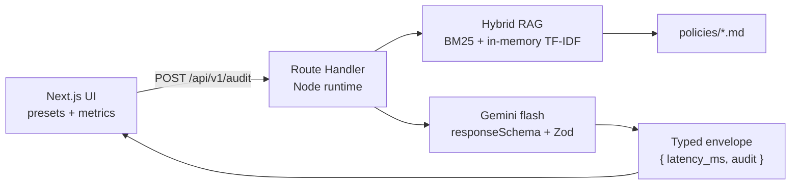

# CloudSec & FinOps Compliance Auditor

Portfolio / curriculum project by **[Caiolinooo](https://github.com/Caiolinooo)**. A corporate-style auditor that ingests CIS / SOC 2 / FinOps-style policies, retrieves the relevant clauses with a **light hybrid RAG**, calls **Gemini** for **strict structured JSON**, and returns risk, citations, and remediation.

Live demo: **[LIVE_DEMO_URL]** *(replace after the Vercel project is linked)*

---

## Architecture



| Layer | Choice | Notes |
| --- | --- | --- |
| App | Next.js App Router + TypeScript + Tailwind | Single Vercel deploy — no FastAPI / no Streamlit |
| API | `POST /api/v1/audit`, `GET /api/health` | Shared Zod schemas (`AuditRequest`, `AuditResult`) |
| Retrieval | Okapi BM25 + hashed TF-IDF vectors + RRF | In-process; no Qdrant cloud required for the demo |
| LLM | `gemini-2.5-flash` → fallback `gemini-2.0-flash` | Override with `GEMINI_MODEL` / `GEMINI_FALLBACK_MODEL` |
| Evals | Vitest (retrieval + schema) + live faithfulness ≥ 0.85 | DeepEval job skips if `GEMINI_API_KEY` secret is missing |

The browser **never** calls Gemini. The UI only `fetch`es `/api/v1/audit`.

### Swap the vector store later (Qdrant)

1. Embed `policies/*.md` chunks with a real embedding model (e.g. Gemini `text-embedding-004`).
2. Upsert into a Qdrant collection (`policies`) with payload `{ policyId, heading, text, sourceFile }`.
3. Replace `scoreDense()` in `src/lib/rag/embeddings.ts` with `qdrant.search`.
4. Keep BM25 + Reciprocal Rank Fusion in `src/lib/rag/retrieve.ts`. The API envelope does not change.

---

## Local run

```bash
npm install
cp .env.example .env.local
# edit .env.local — set GEMINI_API_KEY
npm run dev
```

Open [http://localhost:3000](http://localhost:3000).

Useful commands:

```bash
npm run build        # succeeds without a live key
npm run typecheck
npm run lint
npm test             # retrieval + Zod + deterministic faithfulness
npm run eval         # live audit path; no-ops if GEMINI_API_KEY is unset
```

`npm run build` must not require `GEMINI_API_KEY`. Runtime audits do.

### Environment

| Variable | Required | Default |
| --- | --- | --- |
| `GEMINI_API_KEY` | Runtime (`POST /api/v1/audit`) | — |
| `GEMINI_MODEL` | No | `gemini-2.5-flash` |
| `GEMINI_FALLBACK_MODEL` | No | `gemini-2.0-flash` |

---

## Vercel deploy

1. Import `Caiolinooo/cloudsec-finops-auditor` as a Next.js project.
2. **Project Settings → Environment Variables** → add `GEMINI_API_KEY` (Production + Preview).
3. Optional: `GEMINI_MODEL`, `GEMINI_FALLBACK_MODEL`.
4. Deploy. Confirm `GET /api/health` returns `"gemini_configured": true`.
5. Paste the production URL into this README (`[LIVE_DEMO_URL]`) and the LinkedIn blurb.

Framework preset: **Next.js**. Build command: `npm run build`. Output: default.

---

## CI

Workflow: [`.github/workflows/ci.yml`](.github/workflows/ci.yml)

1. **unit** — `npm ci`, lint, `tsc --noEmit`, Vitest (retrieval for the public-S3 scenario + schema).
2. **eval** — if repository secret `GEMINI_API_KEY` is **missing**, the job logs a skip and stays green. If present, it runs:
   - `npm run eval` (real `runAudit()` + citation grounding ≥ 0.85)
   - DeepEval `FaithfulnessMetric` ≥ 0.85 on the same artifact (`evals/deepeval_faithfulness.py`)

Add the secret: **Settings → Secrets and variables → Actions → `GEMINI_API_KEY`**.

---

## Seed policies

Versioned under [`policies/`](policies/):

| ID | Clause | Severity |
| --- | --- | --- |
| POL-S3-001 | Block Public Access for customer-data buckets | CRITICAL · SOC 2 |
| POL-S3-002 | Versioning + Lifecycle to Glacier after 90 days | FinOps 4.2 |
| POL-IAM-005 | No direct `AdministratorAccess` on IAM users | Least privilege |
| POL-S3-003 / 004 | SSE-KMS, access logging | HIGH / MEDIUM |
| POL-IAM-001 / 003 | MFA, 90-day key rotation | HIGH / MEDIUM |
| POL-FIN-001 / 002 | Idle spend, cost-allocation tags | FinOps |
| POL-NET-001 | No `0.0.0.0/0` on admin ports | HIGH |

---

## Curriculum blurbs

### Português

Auditor de conformidade CloudSec & FinOps: Next.js (App Router) com RAG híbrido (BM25 + vetores locais) sobre políticas CIS/SOC 2/FinOps versionadas em Markdown, Gemini com JSON estruturado validado em Zod, citações e remediação. Demo: **[LIVE_DEMO_URL]** · repo: `cloudsec-finops-auditor`.

### English

CloudSec & FinOps compliance auditor: Next.js App Router, hybrid RAG over versioned CIS/SOC 2/FinOps markdown, Gemini structured JSON (Zod envelope `{ latency_ms, audit }`), citations and remediations. Live: **[LIVE_DEMO_URL]** · GitHub: `cloudsec-finops-auditor`.
